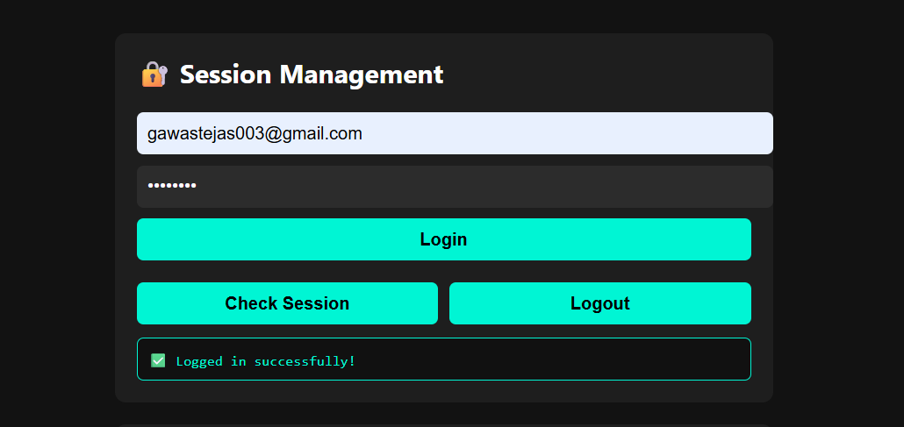
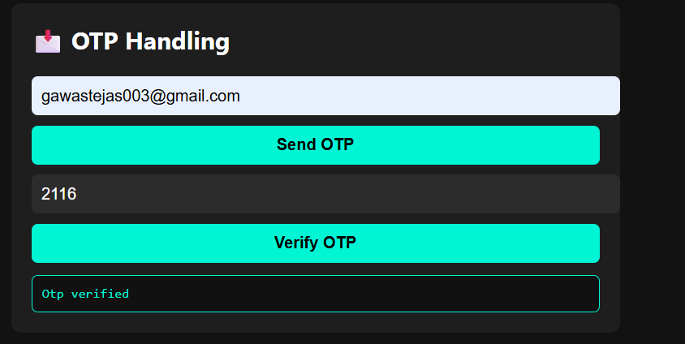
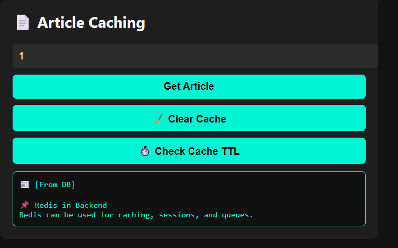
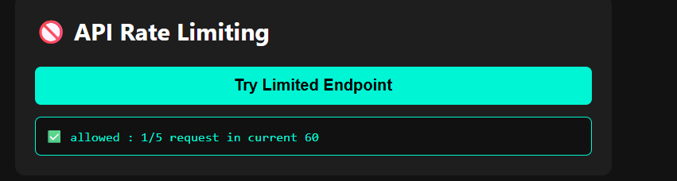

# TaskForge 🔥

A learning-focused backend app using Flask, Redis to simulate real-world engineering tasks.

## ⚙️ Features

- ✅ OTP handling (Redis TTL)
- ✅ Session login/logout (Redis)
- ✅ API Rate Limiting
- ✅ Article Caching with TTL
- ✅ Minimal UI (HTML/CSS/JS)

## 🧱 Tech Stack

- Flask + Blueprints
- Redis (cache, session, rate limit)
- SQLite + SQLAlchemy
- Vanilla HTML, CSS, JS frontend

## 🖼 Demo Screenshot

---

> Made with ❤️ by [Tejash Gawas](https://github.com/Tejashgawas)
